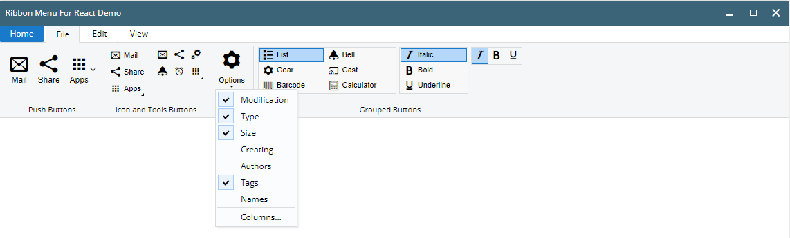
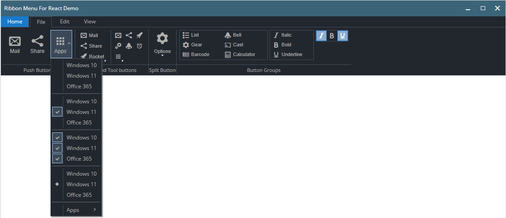

# Ribbon Menu for React




### Ribbon Menu - is a command bar that organizes a program's features into a series of tabs.

In computer interface design, a ribbon is a graphical control element in the form of a set of toolbars placed on several tabs. 
The typical structure of a ribbon includes large, tabbed toolbars, filled with graphical buttons and other graphical control elements, grouped by functionality. 
Such ribbons use tabs to expose different sets of controls, eliminating the need for numerous parallel toolbars. 
Contextual tabs are tabs that appear only when the user needs them.

<hr>

# Component sponsored by [Octostar.co](https://octostar.co/)

- You can contact to sponsor on https://octostar.co/contact-us/
<hr>

## Install
```shell
npm install --save @olton/ribbon-menu
```

## Using
Root element
```jsx
<RibbonMenu>
    ...
</RibbonMenu>
```
Creating menu tabs
```jsx
<RibbonMenu>
    <RibbonTab label="Tab Name" mode={'static' | 'default'}>
        ...
    </RibbonTab>
    ...
</RibbonMenu>
```
### Ribbon Menu Elements
+ [x] RibbonButton
+ [x] RibbonToolButton
+ [x] RibbonIconButton
+ [x] RibbonSplitButton
+ [x] RibbonDropdownMenu
+ [x] RibbonButtonGroup

#### RibbonButton
```jsx
<RibbonButton caption={...} icon={...} image={...} title={...} onClick={...}/>
```
```jsx
<RibbonButton caption="Mail" icon="mif-envelop" title="Write Mail" onClick={()=>{}}/>
```

#### RibbonToolButton
```jsx
<RibbonToolButton caption={...} icon={...} image={...} onClick={...}/>
```
```jsx
<RibbonToolButton caption="Mail" icon="mif-envelop"/>
```

#### RibbonIconButton
```jsx
<RibbonIconButton caption={...} icon={...} image={...} title={...} onClick={...}/>
```
```jsx
<RibbonIconButton caption="Mail" icon="mif-envelop"/>
```

#### RibbonSplitButton
```jsx
<RibbonSplitButton caption="Options" icon="mif-cog">
    <RibbonDropdownMenu>
        ...
    </RibbonDropdownMenu>
</RibbonSplitButton>
```

#### RibbonDropdownMenu
```jsx
<RibbonDropdownMenu>
    <RibbonDropdownItem caption="Windows 10"/>
    <RibbonDropdownItem caption="Windows 11"/>
    <RibbonDropdownItem caption="Office 365"/>
    <RibbonDropdownDivider/>
    <RibbonDropdownCheckItem checked caption="Windows 10"/>
    <RibbonDropdownCheckItem checked caption="Windows 11"/>
    <RibbonDropdownCheckItem checked caption="Office 365"/>
    <RibbonDropdownDivider/>
    <RibbonButtonGroup active={[2]} radio>
        <RibbonDropdownItem caption="Windows 10"/>
        <RibbonDropdownItem caption="Windows 11"/>
        <RibbonDropdownItem caption="Office 365"/>
    </RibbonButtonGroup>
    <RibbonDropdownDivider/>
    <RibbonDropdown>
        <RibbonDropdownItem caption="Apps"/>
        <RibbonDropdownMenu>
            <RibbonDropdownItem caption="Windows 10"/>
            <RibbonDropdownItem caption="Windows 11"/>
            <RibbonDropdownItem caption="Office 365"/>
            <RibbonDropdownDivider/>
            <RibbonDropdownCheckItem checked caption="Windows 10"/>
            <RibbonDropdownCheckItem checked caption="Windows 11"/>
            <RibbonDropdownCheckItem checked caption="Office 365"/>
            <RibbonDropdownDivider/>
        </RibbonDropdownMenu>
    </RibbonDropdown>
</RibbonDropdownMenu>
```

#### Button with Dropdown Menu
```jsx
<RibbonDropdown>
    <RibbonIconButton caption="Rocket" icon="mif-rocket"/>
    <RibbonDropdownMenu>
        ...
    </RibbonDropdownMenu>
</RibbonDropdown>
```

#### RibbonButtonGroup
```jsx
<!-- Radio buttons -->
<RibbonButtonGroup radio  style={{width: "200px", maxHeight: "88px", }}>
    <RibbonIconButton caption="List" icon="mif-list"/>
    <RibbonIconButton caption="Gear" icon="mif-cog"/>
    <RibbonIconButton caption="Barcode" icon="mif-barcode"/>
    <RibbonIconButton caption="Bell" icon="mif-bell"/>
    <RibbonIconButton caption="Cast" icon="mif-cast"/>
    <RibbonIconButton caption="Calculator" icon="mif-calculator2"/>
</RibbonButtonGroup>

<!-- Check buttons -->
<RibbonButtonGroup style={{width: "100px"}}>
    <RibbonIconButton caption="Italic" icon="mif-italic"/>
    <RibbonIconButton caption="Bold" icon="mif-bold"/>
    <RibbonIconButton caption="Underline" icon="mif-underline"/>
</RibbonButtonGroup>

<!-- Preset active state -->
<RibbonButtonGroup active={[1, 3]}>
    <RibbonToolButton caption="Italic" icon="mif-italic"/>
    <RibbonToolButton caption="Bold" icon="mif-bold"/>
    <RibbonToolButton caption="Underline" icon="mif-underline"/>
</RibbonButtonGroup>
```

#### Dropdown Menu Checks Group
```jsx
<RibbonDropdownMenu>
    <RibbonDropdownCheckItem checked caption="Windows 10" onClick={(e)=>{...}}/>
    <RibbonDropdownCheckItem checked caption="Windows 11"/>
    <RibbonDropdownCheckItem checked caption="Office 365"/>
</RibbonDropdownMenu>
```
or
```jsx
<RibbonDropdownMenu>
    <RibbonButtonGroup active={2}>
        <RibbonDropdownItem caption="Windows 10" onClick={(e)=>{...}}/>
        <RibbonDropdownItem caption="Windows 11"/>
        <RibbonDropdownItem caption="Office 365"/>
    </RibbonButtonGroup>
</RibbonDropdownMenu>
```

#### Dropdown Menu Radio Group 
```jsx
<RibbonDropdownMenu>
    <RibbonButtonGroup active={2} radio>
        <RibbonDropdownItem caption="Windows 10" onClick={(e)=>{...}}/>
        <RibbonDropdownItem caption="Windows 11"/>
        <RibbonDropdownItem caption="Office 365"/>
    </RibbonButtonGroup>
</RibbonDropdownMenu>
```

<hr>

### Metro UI
Original component created by [Serhii Pimenov](https://pimenov.com.ua) for [Metro UI](https://korzh.com/metroui).

MetroUI is an open-source frontend toolkit inspired by Microsoft Fluent (former Metro) design principles. You can consider it as a Bootstrap replacement for web sites that need a fresh and catchy look.
MetroUI includes everything you need to build your frontend app: responsive grid system, 100+ prebuilt components, 500+ incons, and powerful JavaScript plugins.

<hr>

### License
Ribbon Menu component is open-source project licensed by [MIT](license) license

### Copyright
Copyright 2022 by [Serhii Pimenov](https://pimenov.com.ua), [Korzh.com](https://korzh.com). 